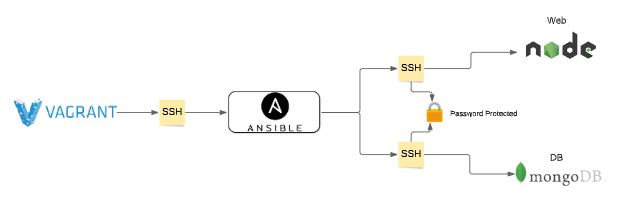

# IAC with Ansible



### Let's create Vagrantfile to create Three VMs for Ansible architecture
#### Ansible controller and Ansible agents 

```

# -*- mode: ruby -*-
 # vi: set ft=ruby :
 
 # All Vagrant configuration is done below. The "2" in Vagrant.configure
 # configures the configuration version (we support older styles for
 # backwards compatibility). Please don't change it unless you know what
 
 # MULTI SERVER/VMs environment 
 #
 Vagrant.configure("2") do |config|
 # creating are Ansible controller
   config.vm.define "controller" do |controller|
     
    controller.vm.box = "bento/ubuntu-18.04"
    
    controller.vm.hostname = 'controller'
    
    controller.vm.network :private_network, ip: "192.168.33.12"
    
    # config.hostsupdater.aliases = ["development.controller"] 
    
   end 
 # creating first VM called web  
   config.vm.define "web" do |web|
     
     web.vm.box = "bento/ubuntu-18.04"
    # downloading ubuntu 18.04 image
 
     web.vm.hostname = 'web'
     # assigning host name to the VM
     
     web.vm.network :private_network, ip: "192.168.33.10"
     #   assigning private IP
     
     #config.hostsupdater.aliases = ["development.web"]
     # creating a link called development.web so we can access web page with this link instread of an IP   
         
   end
   
 # creating second VM called db
   config.vm.define "db" do |db|
     
     db.vm.box = "bento/ubuntu-18.04"
     
     db.vm.hostname = 'db'
     
     db.vm.network :private_network, ip: "192.168.33.11"
     
     #config.hostsupdater.aliases = ["development.db"]     
   end
 
 
 end
```


# Lauch VM's using Vagrantfile

1. Run `vagrant up` from vagrant file location
2. `vagrant status` - ensure they're all running 
3. SSH into each VM and run the following commands:
```
sudo apt-get update -y
sudo apt-get upgrade -y
```
4. `ping bbc.com` - to check if connected to the internet


# Setting up Ansible

- SSH into Controller VM
- Install the following dependencies 
```
sudo apt-get update
  
sudo apt-get install software-properties-common
  
sudo apt-add-repository ppa:ansible/ansible
  
sudo apt-get update -y
  
sudo apt-get install ansible -y

```

- Checking installation `ansible --version`

## SSH from controller to Web/DB

1. SSH into App from controller - `ssh vagrant@<web IP>` 
2. Enter `yes` and then password is vagrant
3. `sudo apt update -y`
4. Redo above steps for db (replace web IP with DB IP)


## Hosts file
- Navigate to `cd /etc/ansible`
- Remove current hosts file - `sudo rm -rf hosts`
- Create new hosts file - `sudo nano hosts`

## Install Tree
- Visually better way of seeing files
- `sudo apt-get install tree`

# Add code into Hosts file
- This will allow the controller VM to connect to the web and db VM's
- Configure hosts file as below:
```
[web]
192.168.33.10 ansible_connection=ssh ansible_ssh_user=vagrant ansible_ssh_pass=vagrant
 
[db]
192.168.33.11 ansible_connection=ssh ansible_ssh_user=vagrant ansible_ssh_pass=vagrant

```

## Ping
Checks connection
- `ansible web -m ping` - pings web
- `ansible db -m ping` - pings db
- `ansible all -m ping` - pings all
- Successful ping will show `pong`

### Add fingerprint authentication
If the above ping commands return failed due to fingerprint error, enter below commands to add each hosts fingerprint to known_hosts:
- `ssh-keyscan -H 192.168.33.10 >> /home/vagrant/.ssh/known_hosts` - adds web
- `ssh-keyscan -H 192.168.33.11 >> /home/vagrant/.ssh/known_hosts` - adds db 


# Ad-hoc Commands
- `ansible all -a "uname -a"` - returns info on all VM listed in hosts file
- `ansible web -a "uname -a"` - returns basic info for web vm
- `ansible web -a "uname -a"` - returns basic info for db vm
- `ansible db -a "ls -a"` - returns a list of files in the home location


# Automating with Provision scripts

- Create a provisioning file to automate dependencies for web and db
- Creating a provisioning file to automate controller installation of Ansible and other dependencies 
- Configure provisioning files in Vagrantfile to run when running vagrant